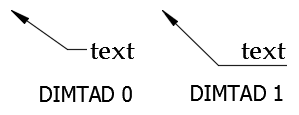
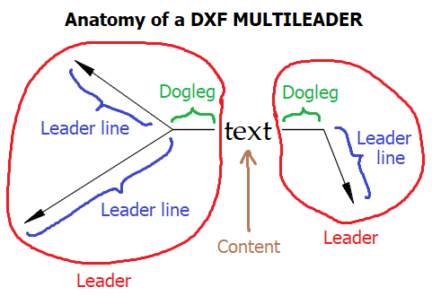
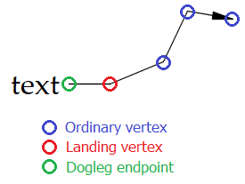

Demystifying DXF: LEADER and MULTILEADER implementation notes
===

<!-- toc -->

- [Introduction](#introduction)
  * [My implementation](#my-implementation)
- [LEADER](#leader)
  * [The hook line](#the-hook-line)
  * [Splines](#splines)
  * [LEADERs are legacy](#leaders-are-legacy)
- [MULTILEADER](#multileader)
  * [Sources of information](#sources-of-information)
  * [Structure](#structure)
  * [Entity handles](#entity-handles)
  * [Geometry](#geometry)
    + [Calculating the dogleg/landing](#calculating-the-dogleglanding)
    + [Breaks](#breaks)
  * [Content](#content)
    + [Text content](#text-content)
    + [Block content](#block-content)
  * [Colors](#colors)
  * [Extrusions (OCS)](#extrusions-ocs)

<!-- tocstop -->

## Introduction

As part of my work on the [DXF driver](http://gdal.org/drv_dxf.html) in the open-source Geospatial Data Abstraction Library ([GDAL](http://gdal.org)), I was tasked with the job of implementing support for leader elements. 

For those unfamiliar with CAD, leaders are essentially arrows emanating from a text label or symbol, serving to point out some important aspect of the drawing.


AutoCAD offers two different kinds of leader objects:

* The "classic" LEADER entity has been part of AutoCAD since the early days, and shares a lot in common with the DIMENSION entity, including a common styling infrastructure (DIMSTYLE and the override system). The documentation for LEADER in the DXF specification is reasonably comprehensive; see the section below.
* The MULTILEADER entity, perhaps better known to AutoCAD users as MLEADER (the name of the command), was introduced in AutoCAD 2008. You can conceptualise it as a strange combination of MTEXT, INSERT, ATTRIB and LWPOLYLINE with enough secret sauce poured on top that you're never really quite sure what's going on. MULTILEADER is one of the worst-documented DXF entities; the description in the DXF spec is next to useless. See below for some tips on how to get it implemented in your project.

I hope these notes, which are intended to supplement the [DXF specification](http://help.autodesk.com/view/OARX/2018/ENU/?guid=GUID-235B22E0-A567-4CF6-92D3-38A2306D73F3), will help those who need to interact with the DXF format programmatically but have limited AutoCAD knowledge, or possibly even no access to the software. I assume a basic level of familiarity with the DXF format. 

### My implementation

[Here](https://github.com/OSGeo/gdal/blob/master/gdal/ogr/ogrsf_frmts/dxf/ogrdxf_leader.cpp) is the C++ code of the DXF LEADER and MULTILEADER translator that I developed for GDAL/OGR. It should not be too difficult to read most of that code even if you're completely unfamiliar with OGR or GDAL. And [here](https://github.com/OSGeo/gdal/blob/master/autotest/ogr/data/leader-mleader.dxf) is a demo DXF file with all kinds of different LEADER and MULTILEADER objects which you can use to test your implementation.

## LEADER

The LEADER entity represents an arrow, made up of one or more vertices (or spline fit points) and an arrowhead. The label or other content to which the LEADER is attached is stored as a separate entity, and is not part of the LEADER itself.

As noted above, LEADER shares its styling infrastructure with DIMENSION. To style these entities correctly, you begin with the styling properties of the selected dimension style, then apply any overrides indicated in the entity itself. The DXF spec provides an example.

Compared to the sprawling complexity of DIMENSION, rendering a simple LEADER entity is easy. It is simply a matter of connecting the vertices by straight line segments and attaching an arrowhead at the end ([in most cases](https://knowledge.autodesk.com/support/autocad/troubleshooting/caas/sfdcarticles/sfdcarticles/Cannot-see-leader-arrowheads.html)). The only difficulty is the "hook line" feature, described in the following section.

### The hook line

If the DIMTAD dimension style property ("Text pos vert" in AutoCAD's Properties pane) is set to anything other than "Centered" (0), the leader line extends beneath the text. This extension is known as a "hook line".



Unfortunately, the endpoint of this hook line is not stored in the DXF file. We have to calculate it using the (211,221,231) direction vector, the text width stored in group code 41, and a "flip" boolean in group code 74. The calculation, written in pseudocode, is as follows (`gc` stands for "group code"):

```
if ( DIMTAD != 0 && gc73 == 0 && gc41 > 0 && count(vertices) >= 2 )
{
    directionVector = (gc211, gc221, gc231) or (1.0, 0.0, 0.0) if the group codes are not present
    if ( gc74 == 1 )
        directionVector = -directionVector
    
    lastVertex = the last (gc10, gc20, gc30) present  
    vertices.append( lastVertex + ( DIMGAP * DIMSCALE + gc41 ) * directionVector )
}
```

This code flips the direction vector when group code 74 is 1, contrary to what the DXF spec appears to say. I assume the spec is wrong on this, since it doesn't match AutoCAD's behaviour.

### Splines

You might also wonder how to render spline LEADERs. The DXF documentation mentions that LEADERs are rendered as splines when group code 72 is set to 1, but it doesn't give any detail.

As far as I can tell, the recipe is like this:

* The "vertices" of the LEADER are treated as equally-weighted fit points of a degree 3 spline.
* The spline is periodic but not planar or closed.
* The fit tolerance is 0.
* The start and end tangent directions are the directions in which the first and last line segment of the leader (including the hook line, if any) would run if the leader was rendered in "line" mode.
* If an arrowhead is present, the final fit point seems to be located at the back of the arrowhead. This point is not given in the DXF data, so you would have to come up with a way to work it out. I decided to ignore this detail in my implementation and just use the given final vertex as the last fit point.

Bear in mind that the vertices are treated as fit points. Elsewhere in the DXF format, splines are generated from control points, so you may need to adjust your logic.

### LEADERs are legacy

Autodesk seems to be very firmly treating LEADER and QLEADER as a legacy feature. The [LEADER user documentation](https://knowledge.autodesk.com/support/autocad/learn-explore/caas/CloudHelp/cloudhelp/2016/ENU/AutoCAD-Core/files/GUID-BC466DEE-ACD8-419A-B017-AB3065336AD7-htm.html) recommends that users switch to the MLEADER workflow, and the default AutoCAD toolbars do not contain a button to insert a LEADER. The reality is, unless you can get all your users to downsave their drawings to pre-2008 DXF versions, you are going to need MULTILEADER support in your DXF reader.

## MULTILEADER

This is where the fun begins. MULTILEADERs differ from LEADERs in a number of important ways:

* MULTILEADERs have nothing to do with DIMENSIONs or LEADERs at all. In particular, they don't use the DIMSTYLE infrastructure. There is a parallel styling system known as MLEADERSTYLE, but if you only need to read DXF files and not write them, you can safely ignore it. This is because, unlike LEADER where only style overrides are stored in the entity, all the styling properties are stored in the MULTILEADER entity itself.
* The content of the MULTILEADER (the text label or block) is described using group codes incorporated into the MULTILEADER entity, rather than being stored as its own separate entity. This is conceptually similar to how DIMENSIONs incorporate the dimension text.
* MULTILEADERs can have zero or more __leader lines__, grouped into zero, one or two __leaders__. Styling properties are applied to all leader lines; for example, it's not possible to style leader lines in different colours.



* Instead of the LEADER "hook line", MULTILEADER leaders have a "dogleg" (referred to as a "landing" in the AutoCAD UI), which is essentially the common final segment of the leader before it reaches the content.
* The documentation in the DXF spec is appalling. It gets off to an inauspicious start when it refers to the entity as "MLEADER" when AutoCAD's DXF writer actually outputs the name MULTILEADER, and it never really improves from there.

### Sources of information

The DXF spec is only one place to look for information on MULTILEADER. 

You should also look at the [ObjectARX documentation for `AcDbMLeader`](http://help.autodesk.com/view/OARX/2018/ENU/?guid=OREF-AcDbMLeader), the C++ class used internally by AutoCAD to represent MULTILEADERs. The DXF representation of MULTILEADER is essentially a spewing-out of the data in this class, much more so than for other entities, so this documentation is especially valuable. For example, the [page on `AcDbMLeader::leaderLineType()`](http://help.autodesk.com/view/OARX/2018/ENU/?guid=OREF-AcDbMLeader__leaderLineType) states that this function returns the leader line type as a [`AcDbMLeaderStyle::LeaderType`](http://help.autodesk.com/view/OARX/2018/ENU/?guid=OREF-AcDbMLeaderStyle__LeaderType) value. From the values of that enum, we now know how to interpret common group code 170!

The [Open Design Alliance reverse-engineer of the DWG format](https://www.opendesign.com/files/guestdownloads/OpenDesign_Specification_for_.dwg_files.pdf), sections 19.4.46 and 19.4.83, acts as a handy cross-reference. The DWG and DXF formats are so similar in structure that the ODA DWG spec references the DXF group codes where it can. Although the copyright statement is rather stern, you are unlikely to use the document to the extent that copyright becomes a concern.

### Structure

Totally missing from the DXF spec is a description of the way the MULTILEADER entity is structured. It is divided into sections by 30x group codes, which always have the text values given below:

```
...              // common group codes
300
CONTEXT_DATA{
  ...            // context data group codes
  302
  LEADER{
    ...          // leader group codes (referred to as "Leader Node" in the DXF spec)
    304
    LEADER_LINE{
      ...        // leader line group codes
    305
    }
    304
    LEADER_LINE{
      ...        // leader line group codes
    305
    }
    ...          // further leader group codes
  303
  }
  302
  LEADER{
    ...          // leader group codes with leader line section(s)
  303
  }
  ...            // further context data group codes
301
}
...              // further common group codes
```

There could be zero or more leader or leader line sections. Group codes have different meanings depending on the section they appear in (the DXF spec got this bit right).

### Entity handles

The MULTILEADER entity refers to other DXF objects by their handle, not by their name. Even text styles and ATTDEF entities, which are always referred to by name in other entities, are referenced by their handle. Common group codes 342, 344 and 330, and context data group codes 340 and 341, are all handle references.

### Geometry

There are three types of vertices in a MULTILEADER:

* The ordinary vertices that make up the leader line, given by a sequence of (10,20,30) group codes in the leader line section.
* The landing point of the leader, given by (10,20,30) group codes in the leader section.
* The dogleg endpoint, which you must calculate -- see below.



Depending on the value of common group code 170, a MULTILEADER may be straight (1), spline (2) or "none" (0). Straight rendering simply involves joining relevant vertices of each leader line and providing a dogleg, interrupting the lines at breaks. Spline rendering is done in the same way as LEADER (see [above](#splines)). "None" means that the leaders are not rendered at all - only the content (text or block) is to be shown.

#### Calculating the dogleg/landing

As with LEADER, some calculations must be performed to find the entire geometry. This involves establishing whether a dogleg needs to be drawn, and if so, calculating the endpoint of the dogleg.

The dogleg endpoint is simply calculated as landing point + (dogleg length * dogleg direction vector).

For a particular leader within the MULTILEADER, a dogleg is drawn if:

* the MULTILEADER has doglegs enabled (common group code 291 is nonzero) *and*
* the MULTILEADER is straight (common group code 170 is 1) *and*
* the dogleg length (leader group code 40) is nonzero *and*
* the dogleg direction vector (leader group codes (11,21,31)) is not a zero vector.

If the dogleg is not drawn, the dogleg endpoint still must be calculated, because in this case, the landing point is ignored and the leader lines terminate at the dogleg endpoint instead.


#### Breaks

Straight MULTILEADER leader lines can be "broken" to avoid intersections with other linework in the drawing. Each break (also known as DIMBREAK, from the AutoCAD command) is stored as a pair of points. The break (gap in the line) begins at the first point and ends at the second point.


The breaks that lie between vertex *n* and vertex *n* + 1 are stored after vertex *n* in the leader line section. Leader line group codes (11,21,31) give the start point and codes (12,22,32) give the end point. The 11,21,31,12,22,32 sequence is repeated for each break in that particular segment of the leader line.

Breaks in the dogleg are stored as part of the leader section. The start of a break is given by leader group codes (12,22,32) and the end by (13,23,33), which may be repeated in the same way.

Breaks are not used in spline MULTILEADERs.

### Content

Common group code 172 determines whether the MULTILEADER has text content (2), block content (1), or no content (0).

#### Text content

In AutoCAD, the text content of a MULTILEADER is internally represented as an `AcDbMText` (MTEXT) data member belonging to the `AcDbMLeader` class. Although the group codes are different, there is a good chance you will be able to share code between your implementations of MTEXT and MLEADER. 

The text is anchored at the point given by context data group codes (12,22,32), corresponding to MTEXT group codes (10,20,30).

Where the same value appears in both the common and context data sections (for example, text color), AutoCAD uses the value given in the context data section.

#### Block content

Instead of text, a MULTILEADER may have a block reference as its content. The common group code 344 stores the handle of a BLOCK_RECORD. Your renderer should insert this block at the position given by context data group codes (15,25,35). The DXF spec lists some other parameters in the context data section (block normal direction, block scale, and block rotation) which are interpreted as for INSERT. There doesn't appear to be a way to set a specific block color for a multileader in AutoCAD, so I don't know what 93 is for.

The group code 47 appears 16 times to give some kind of matrix. Since the last four values seem to always be zero, I assume this is a 3D affine transformation, but it is unclear why this matrix is provided when the rotation, scale and translation are also independently present. In my implementation I have chosen to ignore this matrix, because I assume it's only useful when extrusions are in the picture, and I don't wish to support extrusions of MULTILEADERs for the time being.

Block attributes are stored very differently in MULTILEADER entities compared to an ordinary INSERT. The *handle* (not the name) of the relevant ATTDEF is given in common group code 330, followed by an index (177), a "width" of some kind (44), and the value of the attribute (302). This sequence of four codes is repeated as required. If you are writing a DXF converter, chances are you have chosen to strip out ATTDEF entities; you will clearly need to reconsider this so you can render MULTILEADER block attributes.

A significant amount of my MULTILEADER code in GDAL is taken up processing block attributes. It might seem like a minor and inconsequential feature, but it is actually very important to implement it properly - it is common to see MULTILEADERs which consist of the leader label (say, a key number) enclosed in a circle. This is invariably structured as a block containing a circle and an ATTDEF for the label into which the text needs to be substituted.

### Colors

The overall color of the MULTILEADER is stored in the usual way (62/440 group codes in the common section). But it seems that the developers got lazy for other color values, like common group code 91. The raw value of the `RGBM` union that is part of the [`AcDbEntityColor` class](http://help.autodesk.com/view/OARX/2018/ENU/?guid=OREF-AcCmEntityColor) is written straight to the DXF as a signed 32-bit integer. As an example, this means that ByBlock is no longer the familiar 0, but instead -1056964608 (0xC1000000).

### Extrusions (OCS)

Extrusions, also known as object coordinate systems (OCS), are an aspect of the MULTILEADER entity that I have not explored. If anyone has figured out how these work for MULTILEADER, please feel free to submit an issue or pull request against [this site](https://github.com/atlight/atlight.github.com).

---

Alan Thomas  
[ThinkSpatial](http://www.thinkspatial.com.au)  
athomas@thinkspatial.com.au  
July 2018

This work is licensed under a <a rel="license" href="http://creativecommons.org/licenses/by-sa/4.0/">Creative Commons Attribution-ShareAlike 4.0 International License</a>.

---

[Back to Alan Thomas' home page](/)
